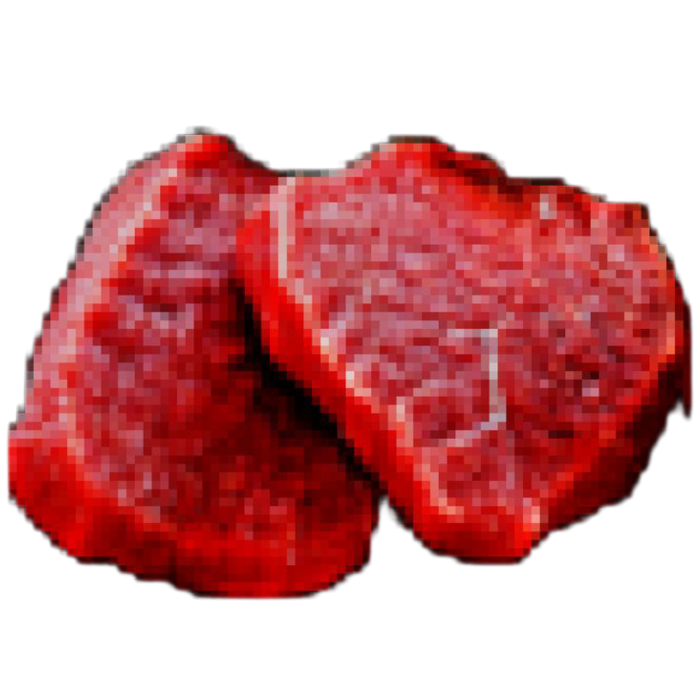
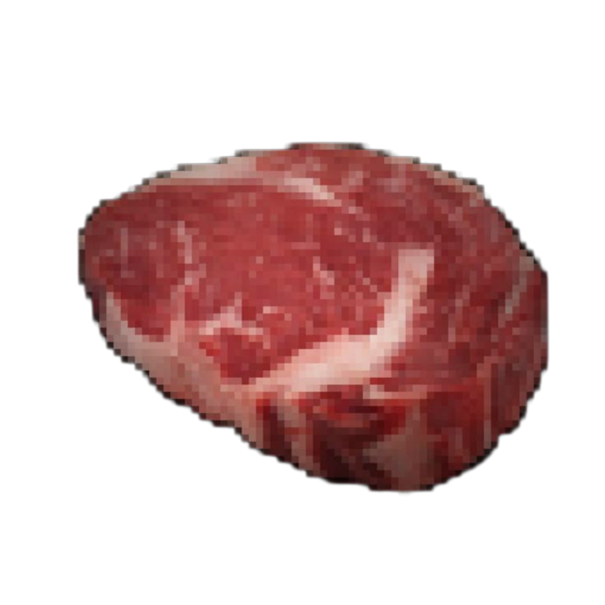
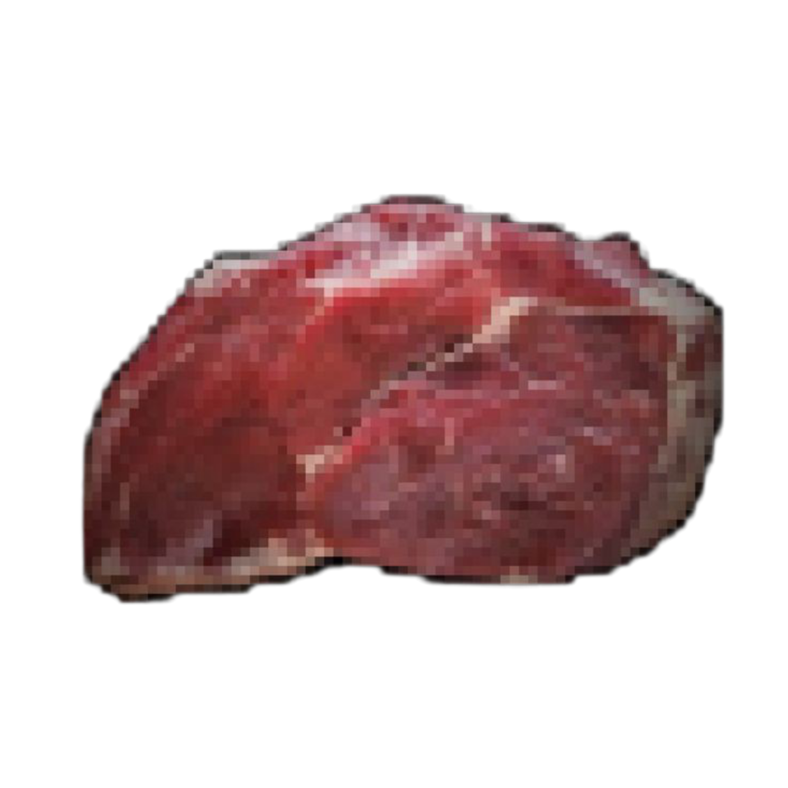
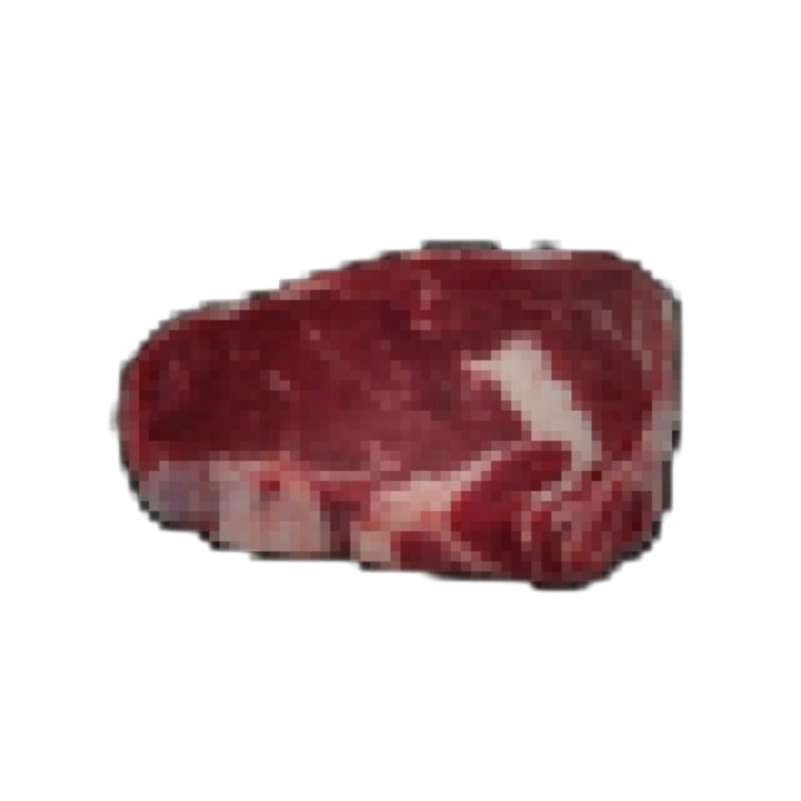
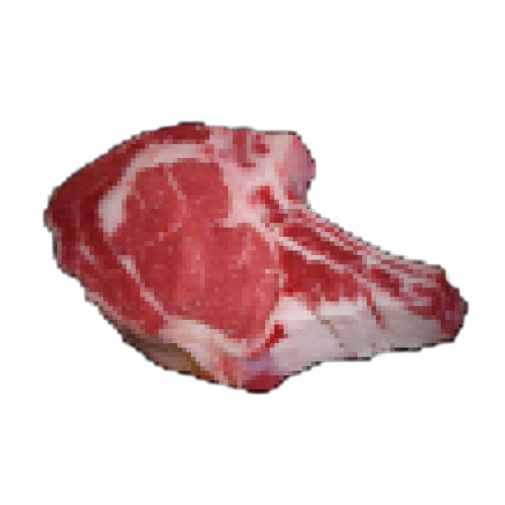

<p align="center">
  
</p>

<h1 align="center"> Привет, я optasiom </h1>
<p align="center"><i>Наблюдающий. Не герой. Не враг.</i></p>

---

##  

```yaml
Псевдоним: optasiom
Роль: Разработчик, аналитик, наблюдатель
Тематика: контроль, тишина, нестабильность
Локация: вне систем
Интерфейс: терминал, команды, холод
```

---

##  

- Языки: Python, JavaScript, Bash  
- Фреймворки: FastAPI, Flask  
- Системы: Linux, Docker, Git  
- Парадигмы: CLI-first, API-first  
- Метод: алгоритмы > оформление  

---

##  

**rubika-shadow-gate**  
 → Базовый каркас для систем переадресации и анализа сообщений.  

**observer-net**  
 → Утилита для невидимого мониторинга активности пользователей.  

**core-rewrite**  
 → Переписанная логика для API-интерфейсов, с уклоном в стабильность и защиту.  

---

##  

<a href="https://git.io/streak-stats"></a>

---

##  

<i>Хаос — это не угроза. Это источник.</i>  
<i>Я не исправляю систему. Я создаю свою.</i>  
<i>Если ты не видишь наблюдателя — это не значит, что его нет.</i>

---

<p align="center">
  
</p>

<p align="center"><i>Мир сломан. Это не беда. Это инструмент.</i></p>
